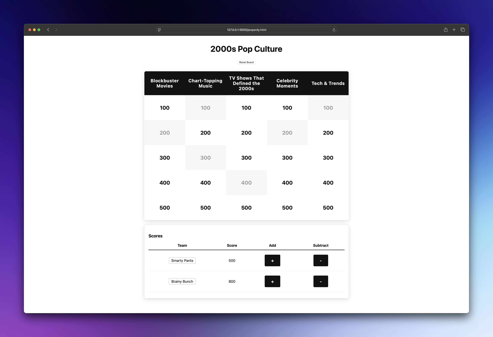
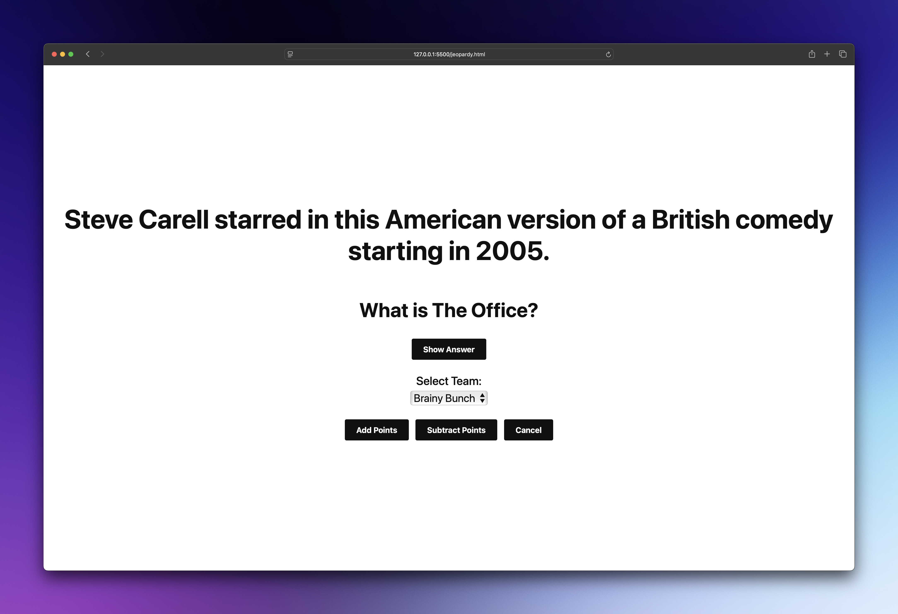

# Jeopardy Web App

**Create and play custom Jeopardy games right in your browser.**



## Quick Start (3 Easy Steps)

### 1. Get the Game
- Download a .ZIP file of this repository (green button at the top of the page)
- Open `jeopardy.html` in any modern web browser
- That's it! No installation needed

### 2. Create Your Game
**Easy Mode**: Use our sample game
- Click "Upload Existing Game Board"
- Select the included `2000s-pop-culture.txt` file
- Click "Load Game Board" and start playing!

**Custom Mode**: Make your own
- Click "Create Board Manually"
- Add your game title and team names
- Fill in 5 categories with 5 questions each
- Save or download your game when done

### 3. Play!
- Click any dollar amount to reveal a question
- Award points to teams for correct answers
- Track scores automatically as you play



## Features That Make It Great

✅ **Works offline** - No internet required once loaded  
✅ **Auto-saves progress** - Your game persists in the browser  
✅ **Import/Export games** - Share with friends or backup your creations  
✅ **Mobile friendly** - Play on phones, tablets, or computers  
✅ **Multiple teams** - Perfect for group competitions  

## Tips for Success

💡 **Creating Questions**: Mix easy and hard questions within each category  
💡 **Team Setup**: You can add or edit teams even during gameplay  
💡 **Saving Work**: Always download your game file as backup  
💡 **File Format**: Simple text format makes editing easy in any text editor  

## Need Help?

**Can't see your game board?** Make sure you clicked "Create Game Board" after filling out the form

**Lost your work?** Check the browser's local storage - your draft might still be there

**Want to edit a game?** Upload the text file and it will load into the creation form

**Questions not displaying?** Ensure your text file follows the format shown in the sample file

## Sample Game File Format

```
Game Title: 2000s Pop Culture

Category 1: Movies
100: This 2001 film featured a computer-generated character named Shrek
Answer: What is Shrek?

Category 2: Music
100: This pop star released the album "Oops!... I Did It Again" in 2000
Answer: Who is Britney Spears?
```

## What Makes This Special

- **Zero setup** - Just open and play
- **Completely private** - Everything runs in your browser
- **Highly customizable** - Make any topic, any difficulty
- **Professional look** - Clean, TV-show-style interface
- **Battle tested** - Used in classrooms, offices, and game nights

---

**Ready to play?** Open `jeopardy.html` and start creating your first game! 🎮
