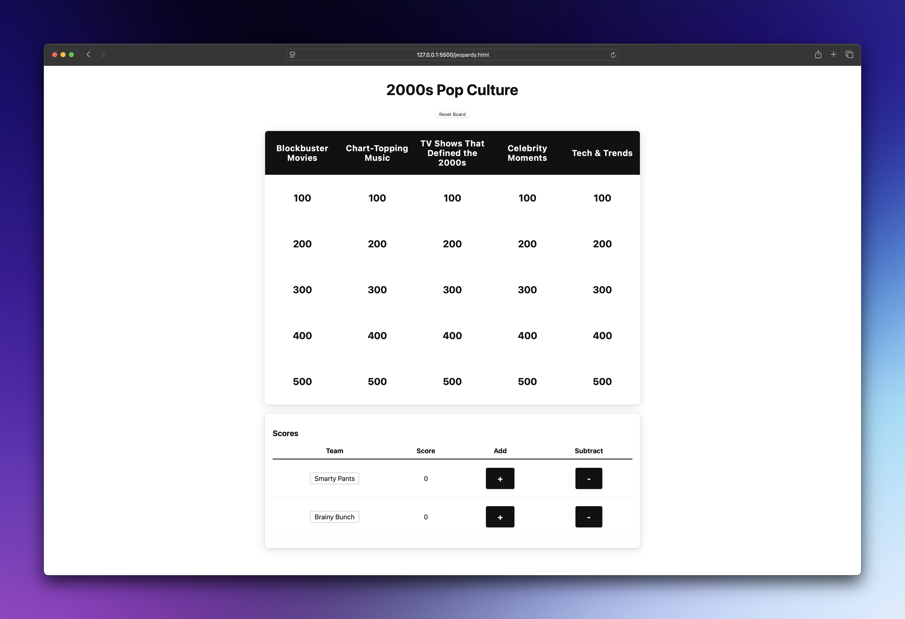
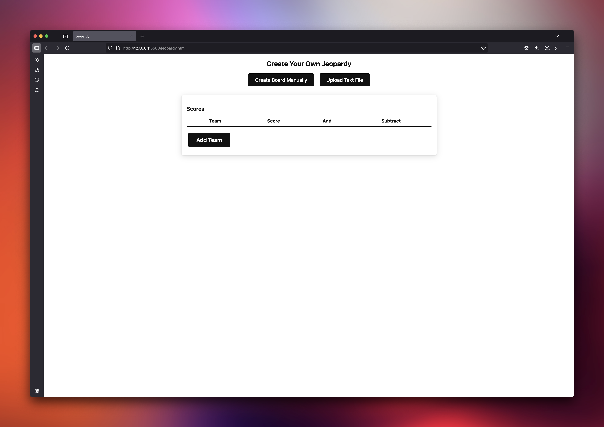
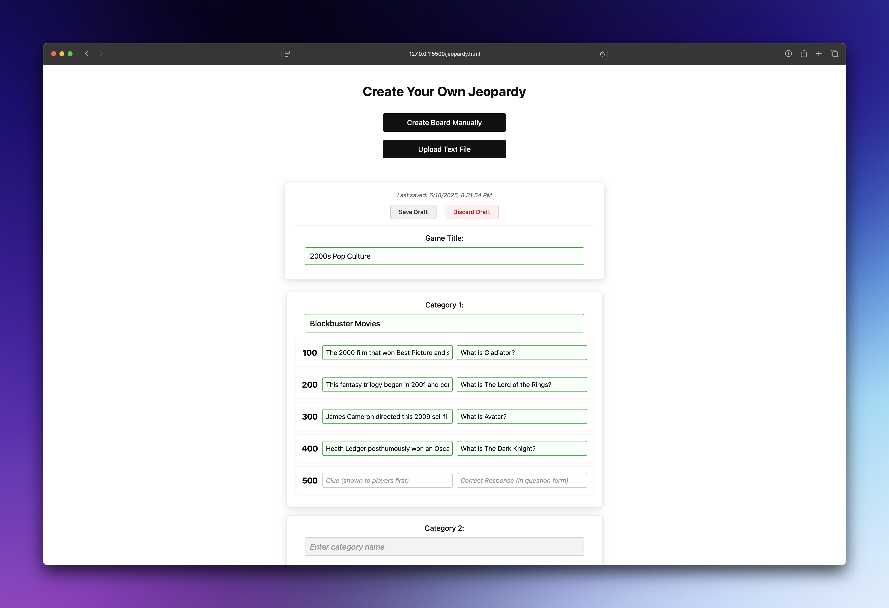
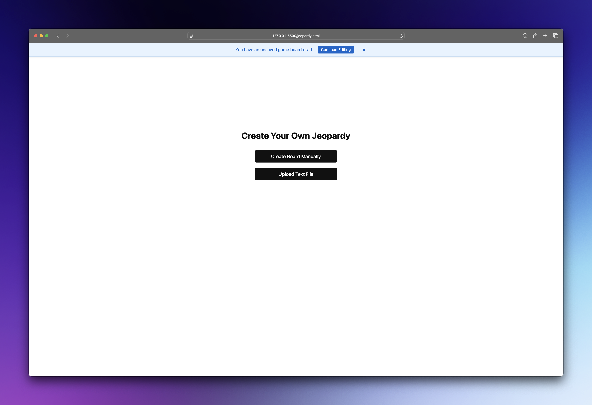
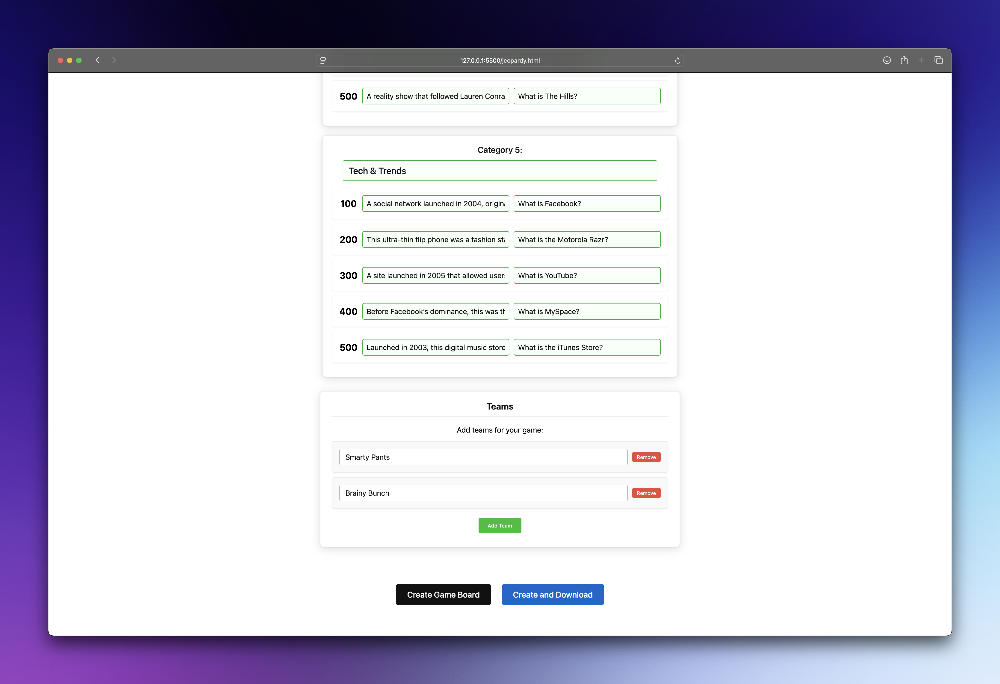
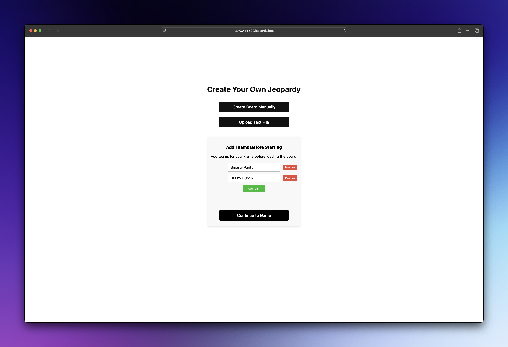

# Jeopardy Game

A web-based Jeopardy game for group presentations and interactive gameplay. Build custom game boards through a form  or upload existing text files for quick setup.

## Screenshots


*Main game board with categories and point values*


*Question and answer screen with team selection and scoring controls*

## Project Structure

### Core Files

- **`jeopardy.html`** - Main HTML structure with game board layout, scoring table, and modal elements
- **`css/jeopardy.css`** - Stylesheet with responsive design for desktop and mobile devices
- **`js/jeopardy.js`** - Game logic handling file uploads, board generation, team management, and persistent storage

### Sample Content

- **`2000s-pop-culture.txt`** - Example game file that can be uploaded to create a previously generated board

## Getting Started

1. **Open the game**: Download the ZIP folder containing all files, and open `jeopardy.html` in a web browser

    

2. **Create or use a game board**:
   
   **Option A: Create a new board**
   - Click "Create Board Manually" on the home screen
   - Fill in the form with your game title, five categories, five questions/answers per category and teams
     - Save a draft at anytime and come back to it later by clicking 'Continue Editing' at the top of the page
   - When complete, click either:
     - "Create Game Board" to generate your game, or
     - "Create and Download" to also save a text file for future use

    

    
    
    

   **Option B: Use an existing board**
   - Click "Upload Text File" and select your previously saved game file
   - Add teams
   - The board will be automatically created and displayed

   

3. **Play the game**: Click on values to reveal answers, show questions, and award points

    

## Exported Text File Breakdown

1. **Title Line** (optional): `Title: Your Game Title`
2. **Category Headers**: `Category: Category Name Here`
3. **Questions**: `POINTS|CLUE|RESPONSE`
   - Points: 100, 200, 300, 400, 500
   - Clue: The statement shown to players first
   - Response: The correct answer in question form
4. **Five Categories**: Each with exactly 5 questions (100-500 points)
5. **Blank Lines**: Ignored by the parser

### Example
```
Title: Early 2000s Pop Culture

Category: Blockbuster Movies
100|The 2000 film that won Best Picture and starred Russell Crowe as a Roman general turned slave.|What is Gladiator?
200|This fantasy trilogy began in 2001 and concluded in 2003 with The Return of the King.|What is The Lord of the Rings?
300|James Cameron directed this 2009 sci-fi epic, which became the highest-grossing film of the decade.|What is Avatar?
400|Heath Ledger posthumously won an Oscar for playing the Joker in this 2008 superhero film.|What is The Dark Knight?
500|This 2002 thriller, directed by Doug Liman and based on a Robert Ludlum novel, launched a successful action franchise starring Matt Damon as a trained assassin suffering from amnesia.|What is The Bourne Identity?
```

## Gameplay Features

- **Team Scoring System**: Add multiple teams, track and edit scores in real-time
- **Flexible Creation**: Build boards through forms or upload existing files
- **Optional Download**: Save boards as text files for future games
- **Persistent Storage**: Game state saves automatically between browser sessions
- **Form Validation**: Real-time feedback ensures all required fields are completed
- **Responsive Design**: Works on desktop and mobile devices

## Data Persistence

The game automatically saves:
- Current game board content
- Team names and scores  
- Used/completed questions
- Game title
- Drafts for partially created game boards

Data persists between browser sessions until manually reset by the `Reset Board` button or by clearing browser cache.


## Technical Notes

- **No server required**: Runs entirely in the browser
- **Modern browsers**: Uses ES6+ JavaScript features
- **File uploads**: Processes local text files with FileReader API
- **Responsive**: CSS Grid and Flexbox for layout
- **Modular**: Separated HTML/CSS/JS for maintainability

---

Copyright (c) 2025 Eric Jones

Licensed under the MIT License. See LICENSE.md for details.