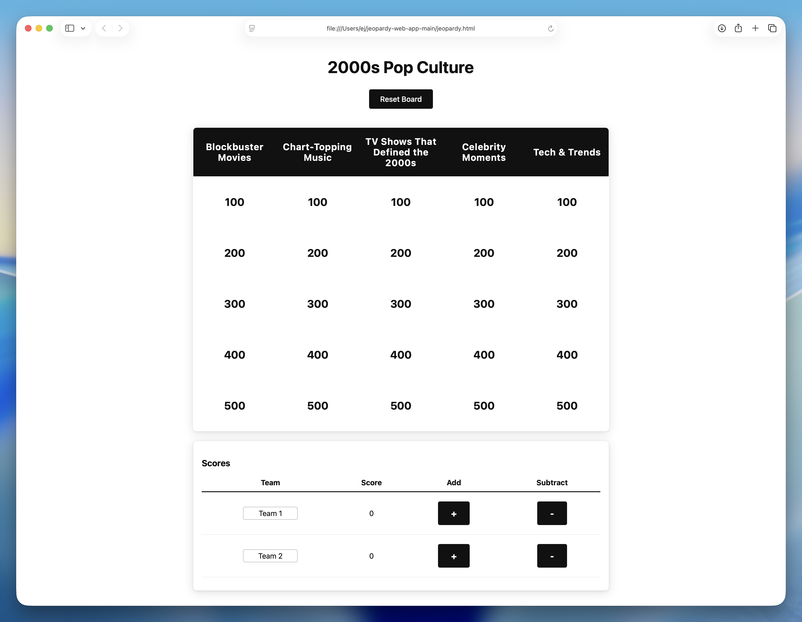
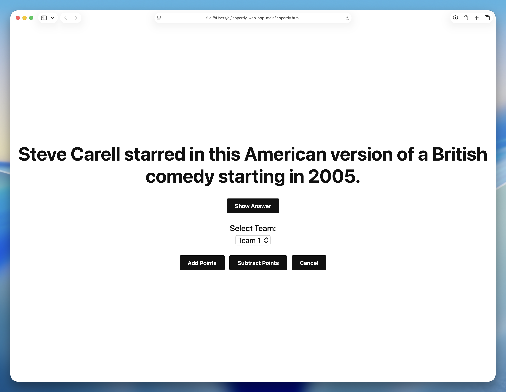
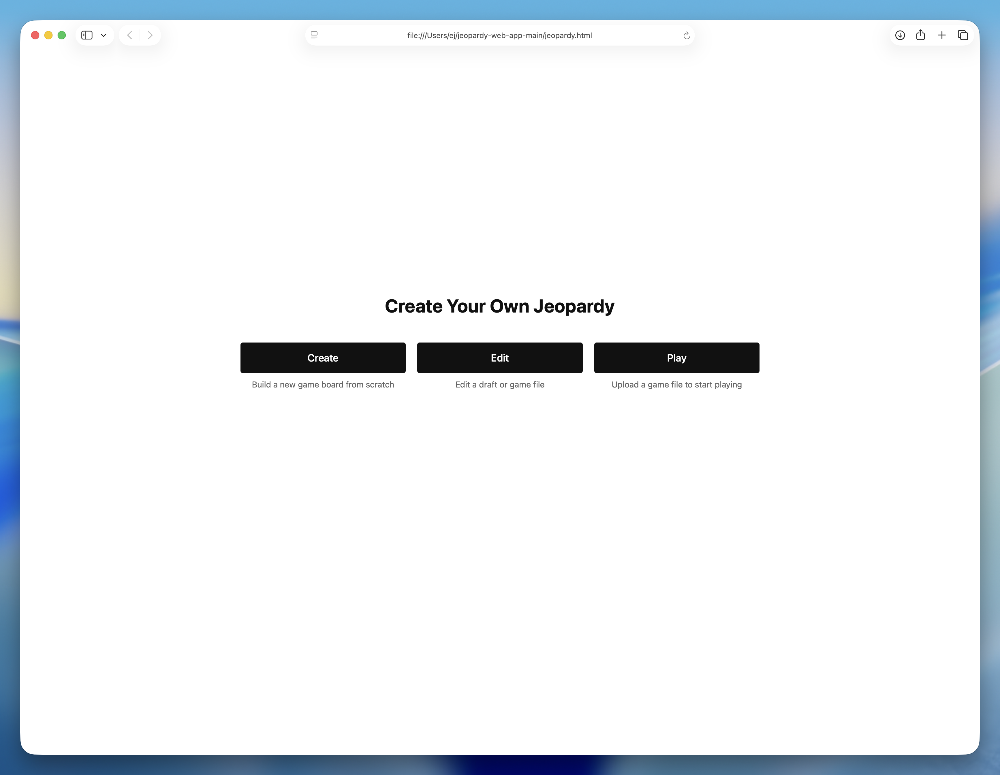
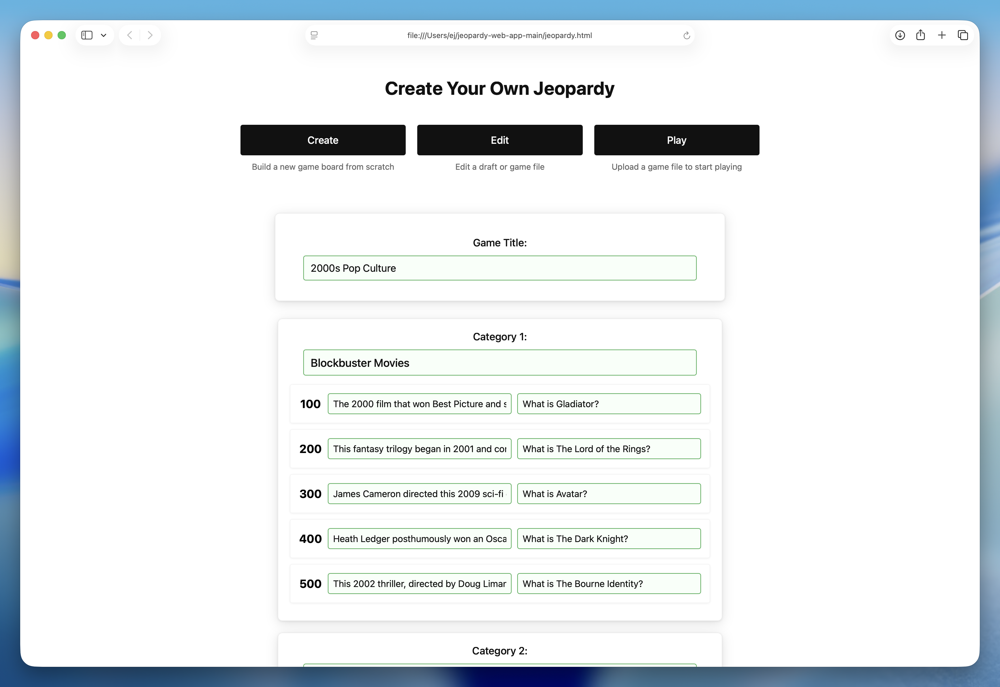
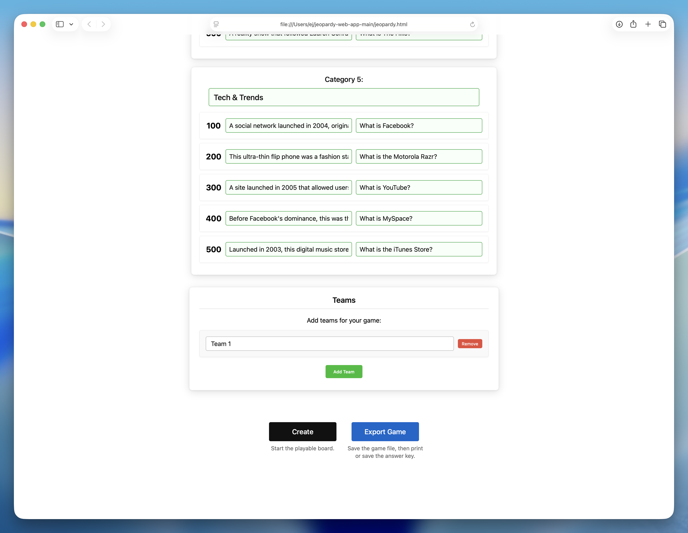
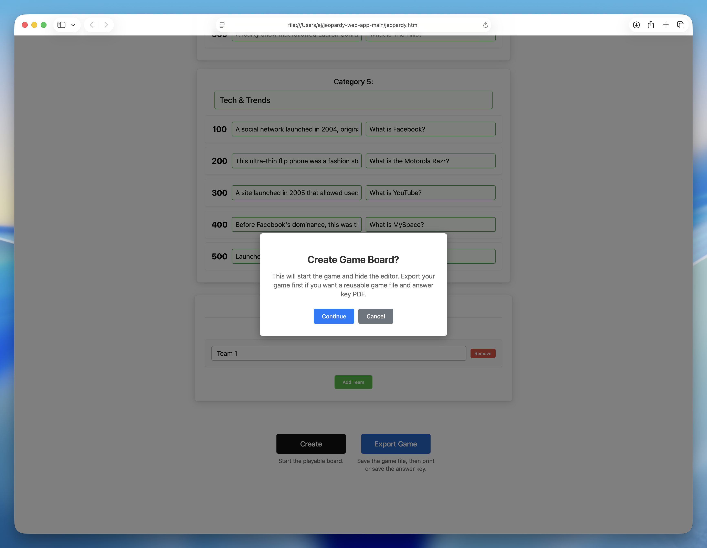
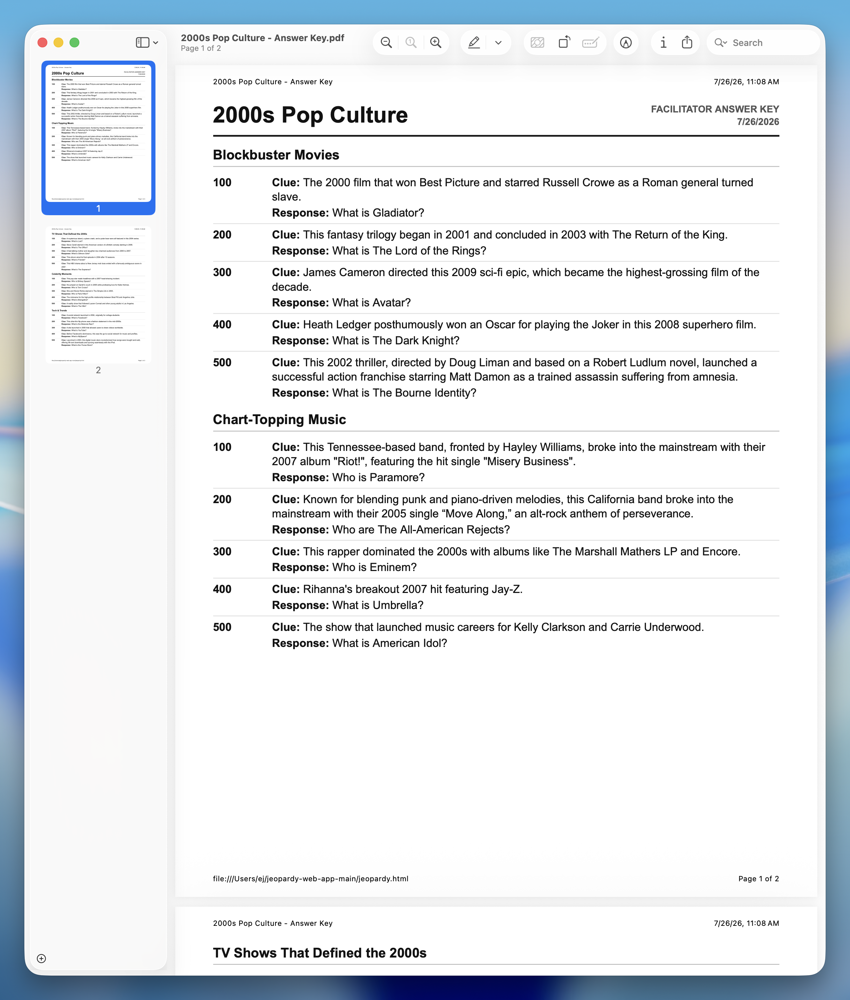
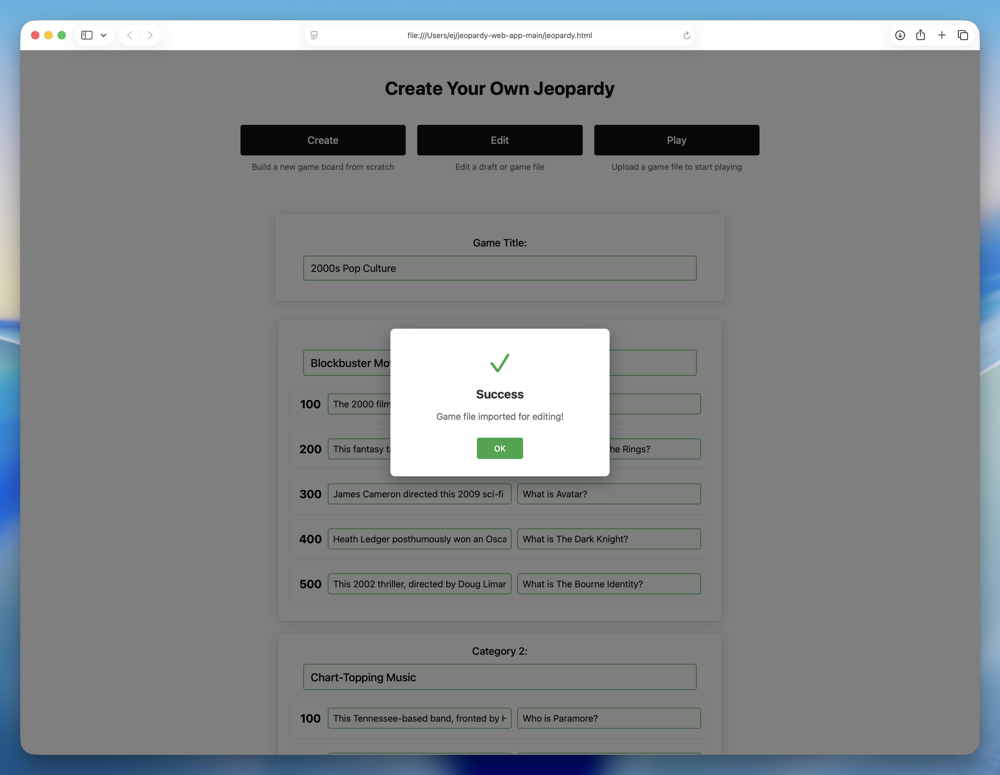
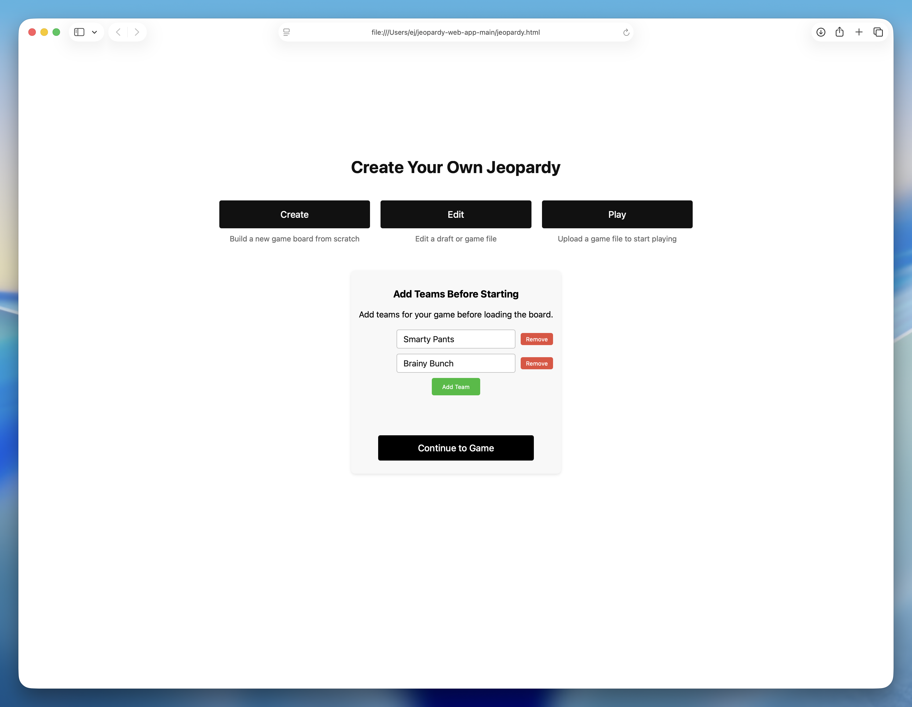

# Jeopardy Web App

An interactive Jeopardy-style game board that runs locally in the browser. Build custom games through a form, export editable drafts, save complete game files, and print or export a facilitator answer key.

## Screenshots



*Main game board with categories and point values*



*Question and answer screen with team selection and scoring controls*

## Quick Start

1. Download or clone the project folder.
2. Open `jeopardy.html` in a modern browser.
3. Choose one of the starting options:
   - `Create`: build a new game from scratch.
   - `Edit`: open a draft or game file for editing.
   - `Play`: open a complete game file and start playing.

No server, account, or build step is required.



## Create A Game

1. Click `Create`.
2. Fill in the game title, 5 categories, 5 clues and responses per category, and teams.
3. While the form is incomplete, use `Export Draft` to save progress.
4. When the form is complete:
   - Use `Export Game` to save the complete game file and open the printable answer key flow.
   - Use `Create` to start the playable board.







## Facilitator Answer Key

When a game is complete, click `Export Game` to download the reusable game file and open the printable facilitator answer key. Use the browser print dialog to print it or save it as a PDF.



## Create A Game With An LLM

You can also use an LLM to draft a game board from source material, then open the generated file in the app for review and editing.

1. Upload [Game Board Generation Prompt.md](<Game Board Generation Prompt.md>) to the LLM.
2. Upload the source files or notes the game should be based on.
3. Use this prompt:

```text
Using "Game Board Generation Prompt.md" as your instructions, use the additional uploaded text files as your sources.
```

4. Save the LLM's output as a plain text `.txt` file.
5. Open the app and click `Edit` to review the generated board.
6. Use `Export Game` when the board is complete and ready to play.

See [LLM-Assisted Game Generation](docs/llm-assisted-generation.md) for the full workflow.

## Edit Or Play Existing Files

Use `Edit` for drafts or complete game files that need changes.



Use `Play` for complete game files that are ready to run.



To try the app, use the included `2000s-pop-culture.txt` file.

## Features

- Build a complete 5 by 5 Jeopardy-style board.
- Export incomplete games as editable draft `.txt` files.
- Export complete games as reusable `.txt` files.
- Generate facilitator answer keys through the browser print dialog.
- Add teams and track scores during gameplay.
- Restore active board state from browser storage.
- Validate required form fields before game creation.
- Run fully locally with plain HTML, CSS, and JavaScript.

## Documentation

Full documentation lives in [docs](docs/index.md):

- [User Guide](docs/user-guide.md)
- [Facilitator Guide](docs/facilitator-guide.md)
- [LLM-Assisted Game Generation](docs/llm-assisted-generation.md)
- [File Format Reference](docs/file-format.md)
- [Export Workflow](docs/export-workflow.md)
- [Technical Overview](docs/technical-overview.md)
- [Code Walkthrough](docs/code-walkthrough.md)
- [Maintenance Guide](docs/maintenance.md)
- [Known Limitations](docs/known-limitations.md)

## Project Structure

```text
.
├── jeopardy.html
├── css/
│   └── jeopardy.css
├── js/
│   └── jeopardy.js
├── docs/
├── screenshots/
├── Game Board Generation Prompt.md
├── 2000s-pop-culture.txt
└── LICENSE.md
```

## File Format Preview

Complete game files are plain text:

```text
Title: Early 2000s Pop Culture

Category: Blockbuster Movies
100|The 2000 film that won Best Picture and starred Russell Crowe as a Roman general turned slave.|What is Gladiator?
200|This fantasy trilogy began in 2001 and concluded in 2003 with The Return of the King.|What is The Lord of the Rings?
300|James Cameron directed this 2009 sci-fi epic, which became the highest-grossing film of the decade.|What is Avatar?
400|Heath Ledger posthumously won an Oscar for playing the Joker in this 2008 superhero film.|What is The Dark Knight?
500|This 2002 thriller, directed by Doug Liman and based on a Robert Ludlum novel, launched a successful action franchise starring Matt Damon.|What is The Bourne Identity?
```

See the [File Format Reference](docs/file-format.md) for full details.

## License

Copyright (c) 2025 Eric Jones

Licensed under the MIT License. See [LICENSE.md](LICENSE.md) for details.
