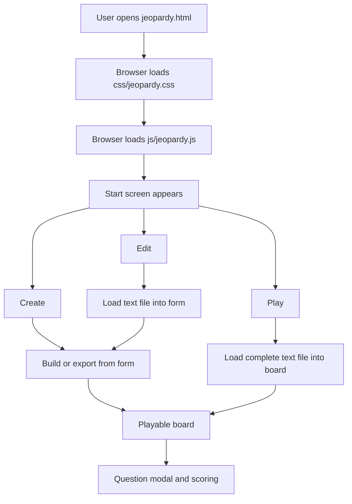
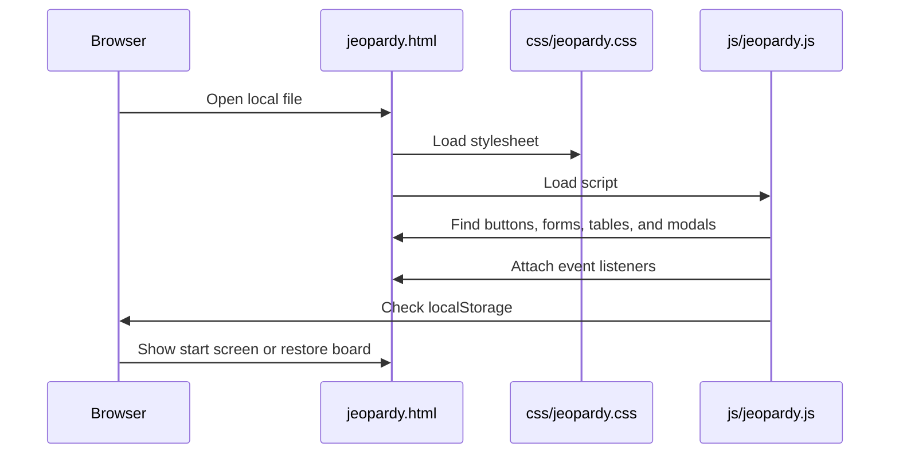
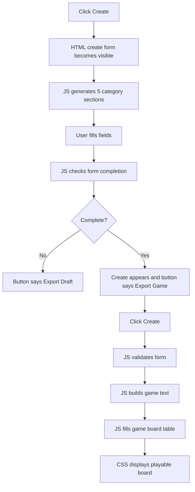
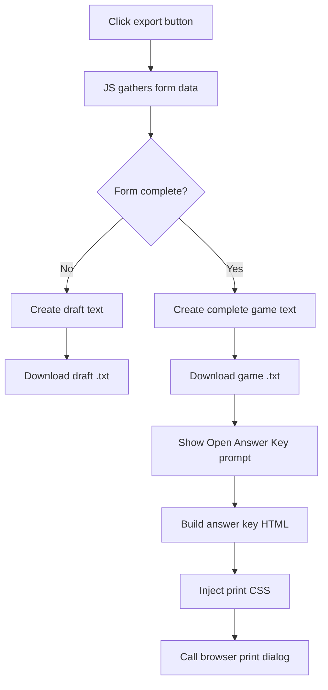
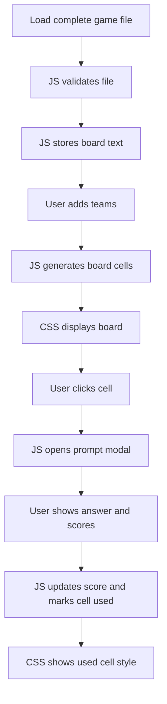

# Code Walkthrough

## Overview

This walkthrough explains how the three core files work on their own and how they work together:

- `jeopardy.html`: defines the page structure and gives JavaScript stable places to attach behavior.
- `css/jeopardy.css`: controls what the app looks like in the browser.
- `js/jeopardy.js`: controls what the app does.

The project is intentionally simple: it is a static browser app. There is no server, database, package install, build tool, or framework. The browser reads the HTML file, loads the CSS and JavaScript, and the JavaScript turns the static page into an interactive game builder and playable board.

## The Big Picture

When someone opens `jeopardy.html`, the browser builds the page from the HTML. The CSS immediately styles the visible page. Then the JavaScript attaches behavior to the buttons, file inputs, form fields, game cells, score table, dialogs, downloads, and print workflow.

Conceptually, the app works like this:



The plain text game file is the main data bridge. The form can produce it, the play flow can consume it, and the answer key can be generated from it.

## `jeopardy.html`

### What This File Does

`jeopardy.html` is the app's skeleton. It defines the major sections of the interface but leaves most of the repeated content empty so JavaScript can fill it in.

It is responsible for:

- Loading the stylesheet.
- Loading the JavaScript file.
- Defining the start screen.
- Defining hidden file inputs.
- Defining the create form container.
- Defining the game board table.
- Defining the score table.
- Defining the confirmation modal.
- Defining the clue/response modal.

The HTML does not contain all 25 form fields or all 25 board cells. Those are generated by JavaScript.

### Document Setup

The page starts with normal browser setup:

```html
<!DOCTYPE html>
<html lang="en">
<head>
  <meta charset="UTF-8">
  <meta name="viewport" content="width=device-width, initial-scale=1.0">
  <title>Jeopardy</title>
  <link rel="stylesheet" href="css/jeopardy.css">
</head>
```

The important pieces are:

- `lang="en"`: identifies the document language.
- `charset="UTF-8"`: supports normal text characters.
- `viewport`: makes the layout scale correctly on smaller screens.
- `title`: sets the browser tab title.
- stylesheet link: loads `css/jeopardy.css`.

At the bottom of the page, the script is loaded:

```html
<script src="js/jeopardy.js"></script>
```

Because the script is at the end of the body, the HTML elements already exist by the time the JavaScript starts looking for them.

### Start Screen

The first visible app area is:

```html
<div id="upload-controls">
```

This section contains the opening heading and the three main choices:

- `Create`
- `Edit`
- `Play`

Each button has an `id`:

```html
<button id="show-create-form">Create</button>
<button id="show-upload">Edit</button>
<button id="load-game-file">Play</button>
```

Those IDs matter because JavaScript uses them to attach click behavior.

In plain English:

- `Create` reveals the form.
- `Edit` opens the draft/game file picker.
- `Play` opens the complete game file picker.

### Hidden File Inputs

The app uses two hidden file inputs:

```html
<input type="file" id="jeopardy-draft-upload" accept=".txt" style="display: none;" />
<input type="file" id="jeopardy-game-upload" accept=".txt" style="display: none;" />
```

They are hidden because the user should click friendly buttons, not browser-default file input controls.

When the user clicks `Edit`, JavaScript triggers the draft upload input.

When the user clicks `Play`, JavaScript triggers the game upload input.

Both only accept `.txt` files.

### File Team Setup

When a complete game file is loaded through `Play`, the app needs team names before the board starts. The HTML provides this hidden area:

```html
<div id="file-teams-setup" class="hide">
```

It contains:

- A heading.
- A container where JavaScript adds team inputs.
- An `Add Team` button.
- A `Continue to Game` button.

JavaScript removes the `hide` class when this step is needed.

### Create Form Container

The create form starts hidden:

```html
<div id="create-form" class="hide">
```

Inside it, the HTML includes:

- The title input.
- An empty category container.
- A validation message area.
- A team setup section.
- The form action buttons.

The category container is intentionally empty:

```html
<div id="categories-container">
  <!-- Category inputs will be generated here -->
</div>
```

JavaScript fills that area with 5 category sections, and each category section gets 5 clue rows.

### Form Action Area

The bottom of the form contains two action blocks:

```html
<div id="create-action" class="action-block hide">
  <button id="generate-board">Create</button>
  <p class="action-description">Start the playable board.</p>
</div>

<div class="action-block">
  <button id="generate-download">Export Draft</button>
  <p id="export-description" class="action-description">Save your progress as an editable draft.</p>
</div>
```

This area is designed so JavaScript can change the workflow based on form completion.

When the form is incomplete:

- `Create` stays hidden.
- The export button says `Export Draft`.
- The helper text explains draft saving.

When the form is complete:

- `Create` appears.
- The export button says `Export Game`.
- The helper text explains game file and answer key export.

### Game Title

The game title shown above the board is:

```html
<h1 id="title"></h1>
```

It starts empty. JavaScript fills it when a game is created or loaded.

### Reset Button

The reset button lives in:

```html
<div id="reset-board-container">
  <button id="reset-board">Reset Board</button>
</div>
```

The CSS hides this at first. JavaScript shows it after a board is loaded.

### Game Board Table

The playable board is a table:

```html
<table id="game" class="hide">
```

The table header starts with placeholder category labels:

```html
<th>Category 1</th>
...
<th>Category 5</th>
```

The body is empty:

```html
<tbody id="game-body">
  <!-- Board cells will be dynamically generated -->
</tbody>
```

JavaScript replaces the placeholder category names and generates all 25 cells.

### Score Table

Scores live in:

```html
<div id="stats" style="display: none;">
```

The table has a fixed header:

- Team
- Score
- Add
- Subtract

The body is empty:

```html
<tbody id="stats-body">
  <!-- Teams will be dynamically added here -->
</tbody>
```

JavaScript renders team rows into this body.

### Create Confirmation Modal

Before the app hides the editor and starts the playable board, it asks for confirmation:

```html
<div id="confirmation-modal">
```

This modal protects the user from accidentally starting the board before exporting the reusable game file and answer key.

### Question And Scoring Modal

The clue modal is:

```html
<div id="prompt">
```

It includes:

- `prompt-question`: the clue shown to players.
- `prompt-answer`: the response, initially hidden.
- `show-answer`: reveals the response.
- `prompt-team-select`: chooses the team.
- `prompt-add-points`: adds the point value to that team.
- `prompt-subtract-points`: subtracts the point value from that team.
- `prompt-cancel`: closes without marking the cell used.

This modal is reused for every board cell.

## `css/jeopardy.css`

### What This File Does

`css/jeopardy.css` controls the visual presentation of the app.

It is responsible for:

- Base typography and page spacing.
- Form card styling.
- Category and clue row layout.
- Start screen button layout.
- Form action button sizing.
- Validation states.
- Game board styling.
- Modal styling.
- Score table styling.
- Responsive behavior for smaller screens.

The CSS is not responsible for deciding what appears when. JavaScript toggles classes and inline display values; CSS defines what those classes and elements look like.

### Base Page Styling

The `body` rule sets the overall feel:

```css
body {
    background: #fff;
    font-family: system-ui, -apple-system, BlinkMacSystemFont, "Segoe UI", Roboto, Arial, sans-serif;
    min-height: 100vh;
    margin: 0;
    padding-bottom: 100px;
}
```

This gives the app:

- A white background.
- A system font stack.
- Full viewport height.
- No browser default margin.
- Bottom breathing room so form actions are not jammed against the browser edge.

### Form Sections

Form sections use card-like containers:

```css
.form-section { ... }
.category-section { ... }
```

These rules give the title area, team area, and categories:

- Maximum width.
- Centered layout.
- Padding.
- Light shadow.
- Subtle border.
- Rounded corners.

This makes a long form easier to scan.

### Category Rows

Each clue row uses `.question-item`.

In the form, a row contains:

- A point value.
- A clue input.
- A response input.

The `.question-value` rule gives the point value a fixed visual width, while the inputs flex to fill the rest of the row.

This is why the form reads like a table without being a table.

### Start Screen Buttons

The start screen uses:

```css
.option-buttons
.option-card
.option-card button
.option-description
```

These rules create three evenly spaced choices:

- Create
- Edit
- Play

The text beneath each button is explanatory, but not interactive.

### Form Action Buttons

The form action area uses:

```css
.form-actions
.action-block
.form-actions button
.action-description
#generate-download
```

The important design choice is that form action buttons share a consistent size:

```css
width: 170px;
min-height: 48px;
```

That keeps `Create` and `Export Game` visually balanced even though their labels have different lengths.

The export button has a distinct color so it does not look identical to `Create`.

### Validation Styling

Required fields use:

```css
.required-field
.required-field.has-content
.validation-error
#validation-message
```

The app uses these states to show whether a field has content or needs attention.

JavaScript adds and removes the classes. CSS defines how those states look.

### Utility Class

The app uses a simple utility class:

```css
.hide {
    display: none !important;
}
```

This is one of the main ways JavaScript controls the interface.

Examples:

- The create form starts hidden.
- The game board starts hidden.
- The `Create` action starts hidden until the form is complete.

### Game Board Styling

The playable board is styled through:

```css
#game
#game thead th
#game tbody td
#game td.used
```

The table is centered and styled to feel like a game board. Category headers are visually distinct from point cells.

When a cell has been used, JavaScript adds the `used` class. CSS then changes the cell's appearance so players can tell it is no longer available.

### Prompt Modal Styling

The clue/response modal is styled through:

```css
#prompt
#prompt-question
#prompt-answer
.prompt-controls
```

The modal is hidden by default and shown by JavaScript when a user clicks a board cell.

It uses fixed positioning so it appears over the rest of the game.

### Confirmation Modal Styling

The create confirmation modal is styled through:

```css
#confirmation-modal
.confirmation-content
.confirmation-buttons
```

The modal is hidden until JavaScript displays it. It appears as a centered dialog over a dimmed page background.

### Score Styling

The score table uses:

```css
#stats
#stats table
#stats th
#stats td
input.team-name
```

This section keeps scoring compact and readable during gameplay.

### Responsive Styling

At the bottom of the CSS file, the app uses:

```css
@media (max-width: 768px)
```

This adjusts layout for narrower screens. The main goal is to keep buttons and form sections from becoming cramped on mobile-sized viewports.

### Important Print Styling Note

The answer key print styles are not in `css/jeopardy.css`.

They are injected by `js/jeopardy.js` only when the answer key print workflow runs. That keeps the regular app CSS separate from temporary PDF/print layout CSS.

## `js/jeopardy.js`

### What This File Does

`js/jeopardy.js` is the app's behavior layer.

It is responsible for:

- Reading and writing browser storage.
- Validating draft and game files.
- Parsing plain text game files.
- Creating the form fields.
- Tracking form completion.
- Exporting draft and complete game files.
- Building the playable board.
- Handling board cell clicks.
- Showing clues and responses.
- Managing teams and scores.
- Saving used cells.
- Resetting the app.
- Creating custom dialogs.
- Building and printing the answer key.

### Startup Behavior

When the page loads, the JavaScript checks browser storage.

It looks for:

- A saved form draft.
- A saved board.
- A saved title.
- Saved teams.
- Used board cells.

If a board exists, the app restores it. If a draft exists but no active board exists, the app can notify the user that there is an unsaved game board draft.

In plain English: the app tries to pick up where the user left off.

### Storage Helper

The code wraps `localStorage` in a small helper:

```js
const storage = {
    save: ...,
    load: ...,
    remove: ...,
    clear: ...
};
```

Instead of calling `localStorage` directly everywhere, much of the app uses this helper to save and load JSON data.

The main storage keys are:

- `jeopardyFormDraft`
- `jeopardyBoard`
- `jeopardyTitle`
- `jeopardyTeams`
- `jeopardyUsedCells`

### Parsing Game Text

The parser turns plain text into structured data.

It reads lines like:

```text
Title: 2000s Pop Culture
Category: Blockbuster Movies
100|Clue text|Correct response
```

And produces data shaped like:

```js
{
  title: "2000s Pop Culture",
  categories: [
    {
      name: "Blockbuster Movies",
      clues: [
        {
          value: "100",
          question: "Clue text",
          answer: "Correct response"
        }
      ]
    }
  ]
}
```

This parsed structure is used by both the playable board and the answer key.

### File Validation

The app has two validation paths.

`validateDraftFile()` is permissive. It allows:

- Draft files.
- Complete game files being reopened for editing.
- Incomplete game-like files.

This makes `Edit` flexible.

`validateGameFile()` is strict. It rejects:

- Draft files.
- Files that do not start with `Title:`.
- Files with fewer than 5 categories.
- Files with incomplete categories.

This keeps `Play` from starting with a broken board.

### File Uploads

The app listens for changes on the hidden file inputs.

For `Edit`:

1. User clicks `Edit`.
2. JavaScript clicks the hidden draft upload input.
3. Browser shows a file picker.
4. User chooses a `.txt` file.
5. JavaScript reads it with `FileReader`.
6. The app parses the file and fills the form.

For `Play`:

1. User clicks `Play`.
2. JavaScript clicks the hidden game upload input.
3. Browser shows a file picker.
4. User chooses a complete `.txt` file.
5. JavaScript validates it.
6. The app shows the team setup step.
7. The board loads after `Continue to Game`.

### Form Creation

The HTML does not manually define all category and clue inputs. JavaScript creates them with `addCategory()`.

Each category section gets:

- A category name input.
- 5 clue rows.
- Point values from `DEFAULT_VALUES`.
- One clue input per point value.
- One response input per point value.

This keeps the HTML much shorter and ensures each category has the same structure.

### Form State

The app gathers form state with `gatherFormData()`.

That function reads:

- The title.
- Category names.
- Clues.
- Responses.
- Teams.

Then `isFormComplete()` checks whether the form has everything needed for a complete 5 by 5 game.

### Button Logic

The workflow button state is controlled by `updateFormActionState()`.

When the form is incomplete:

```text
Export Draft
```

When the form is complete:

```text
Export Game
```

The same function also hides or shows the `Create` button.

This is why the user does not need to decide whether they are saving a draft or exporting a complete game. The app decides based on the form.

### Creating The Board

When the user clicks `Create`, the app first validates the form.

If validation passes:

1. The confirmation modal appears.
2. The user clicks `Continue`.
3. The app builds the plain text game file in memory.
4. The app saves the board text and title in local storage.
5. The app clears the form draft.
6. The app populates the game board from the text.
7. The app transfers form teams into gameplay teams.
8. The app hides the editor.
9. The app shows the playable board, title, reset button, and score table.

### Exporting A Draft

When the form is incomplete and the user clicks `Export Draft`, the app calls `createDraftFromForm()`.

The draft starts with:

```text
[JEOPARDY DRAFT]
```

It also includes:

- Title
- Created timestamp
- Teams
- Categories
- Any clues and responses already entered

Then `downloadBoardFile()` creates a temporary download link and downloads the file.

### Exporting A Complete Game

When the form is complete and the user clicks `Export Game`, the app:

1. Builds complete game text.
2. Downloads the `.txt` game file.
3. Shows the `Game File Download Started` prompt.
4. Waits for the user to click `Open Answer Key`.
5. Opens the browser print dialog for the answer key.

This keeps Safari's download prompt from being covered by the print dialog.

### Downloading Text Files

Text downloads use a temporary anchor element:

```js
const element = document.createElement('a');
element.setAttribute('href', 'data:text/plain;charset=utf-8,' + encodeURIComponent(content));
element.setAttribute('download', filename);
element.click();
```

In plain English:

1. Build an invisible link.
2. Put the text file content into the link.
3. Tell the browser what filename to use.
4. Click the link with JavaScript.
5. Remove the link.

### Answer Key Printing

The answer key flow uses the complete game text as its source.

The app:

1. Parses the game text.
2. Builds answer key HTML.
3. Adds a hidden print area to the page.
4. Injects print-only CSS.
5. Temporarily changes the document title to improve the suggested PDF filename.
6. Calls `window.print()`.
7. Restores the original title and later removes the temporary print area.

The print CSS hides the normal app and prints only the answer key.

### Board Generation

The playable board is generated by `generateGameBoard()` and filled by `populateJeopardyBoardFromText()`.

The process is:

1. Clear the existing board body.
2. Create 5 table rows.
3. Create 5 cells per row.
4. Put the point value in each cell.
5. Store the clue and response inside hidden elements.
6. Replace category headers with real category names.
7. Attach click handlers to each cell.

The board is generated from the same text format that export creates. This keeps creation, upload, play, and answer key generation centered on one shared data format.

### Gameplay Modal

When a user clicks a cell:

1. The app stores that cell's point value.
2. It reads the hidden clue and response.
3. It puts the clue into the modal.
4. It hides the response until `Show Answer` is clicked.
5. It updates the team dropdown.
6. It displays the modal.

If the facilitator awards or subtracts points, the app updates the selected team's score and marks the cell as used.

If the facilitator clicks `Cancel`, the modal closes and the cell remains available.

### Scoring

Teams are stored as objects:

```js
{ name: "Team 1", score: 0 }
```

The score table is rebuilt whenever teams or scores change.

Scores can change from:

- The clue modal.
- The manual plus/minus buttons in the score table.

After changes, the app saves teams to local storage.

### Used Cells

When a cell has been scored, the app adds the `used` class.

The used cell IDs are saved in local storage. If the page refreshes, the app can restore which cells have already been played.

### Reset

The reset button clears stored state and reloads the page.

It clears:

- Board text.
- Board title.
- Teams.
- Used cells.
- Form draft.

This returns the app to a clean start screen.

### Custom Dialogs

The app uses a `CustomDialog` helper instead of browser-native alerts.

It supports:

- Alert dialogs.
- Confirmation dialogs.
- Success dialogs.
- Error dialogs.
- Custom button sets.

The export workflow uses this for the intermediate `Open Answer Key` prompt.

## How The Files Work Together

### Opening The App



The HTML provides the elements. The CSS makes them presentable. The JavaScript decides what should happen next.

### Creating A New Game



The form itself is a collaboration:

- HTML gives JavaScript the container.
- JavaScript creates the fields.
- CSS makes the fields readable.
- JavaScript watches the fields and changes the buttons.

### Exporting Drafts And Games



This workflow uses all three files:

- HTML contains the export button and prompt infrastructure.
- CSS sizes and styles the visible buttons.
- JavaScript decides draft versus complete game and handles download/print behavior.

### Playing A Game



The game board is not hardcoded. It is built from parsed text every time a game starts.

## Why The App Is Structured This Way

The current design keeps the project easy to understand:

- HTML stays focused on stable page regions.
- CSS stays focused on presentation.
- JavaScript owns dynamic behavior and data transformations.
- Plain text files act as the durable game format.
- Browser APIs handle local file reads, downloads, storage, and printing.

That means a facilitator can use the app without setup, and a maintainer can trace most behavior from a button ID in `jeopardy.html` to an event listener in `js/jeopardy.js`.

## Good Places To Start When Making Changes

Use this map when looking for specific behavior:

| Change Needed | Start Here |
| --- | --- |
| Rename a visible button | `jeopardy.html`, then related JavaScript state updates |
| Change button sizing or colors | `css/jeopardy.css` |
| Change when `Create` appears | `updateFormActionState()` in `js/jeopardy.js` |
| Change draft export text | `createDraftFromForm()` in `js/jeopardy.js` |
| Change complete game text | `createBoardTextFromForm()` in `js/jeopardy.js` |
| Change answer key layout | `buildAnswerKeyHtml()` in `js/jeopardy.js` |
| Change answer key print styling | `openAnswerKeyPrintWindow()` in `js/jeopardy.js` |
| Change file validation | `validateDraftFile()` or `validateGameFile()` in `js/jeopardy.js` |
| Change game board cells | `generateGameBoard()` and `populateJeopardyBoardFromText()` in `js/jeopardy.js` |
| Change scoring | team and prompt scoring functions in `js/jeopardy.js` |

